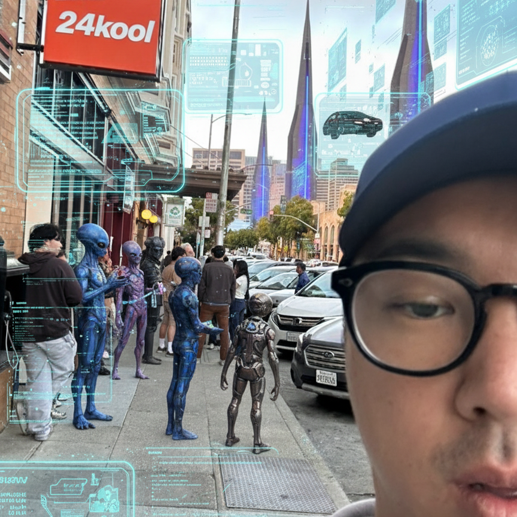

<div align="center">
  
  <!-- 프로필 이미지 (둥근 사각형) -->
  
  
  <h3>🚀 Full Stack Engineer & AI Innovator</h3>
  
  [](https://git.io/typing-svg)
  
</div>

---

## 👨‍💻 About Me

```typescript
const kcKim = {
  role: "Full Stack Engineer & AI Specialist",
  currentFocus: "Building AI-powered applications that solve real-world problems",
  techStack: [
    "TypeScript", "Python", "Java", "React", "FastAPI", "Node.js", "PyTorch", "HuggingFace" "LangChain", "Ollama", "NumPy","Pandas","OpenCV", "Jupyter", "Docker", "Git", "Linux", "GCP","Firebase", "Figma", "Gradio",
  ],

  passions: ["Proactive & Positive Mindset", "Grinding & Continuous Improvement", "Innovation"],

  funFacts: "Before training AI models, I was trained by two armies 🇰🇷🇺🇸"
};
```

### 🌟 Other Experience Beside SWE
```yaml
Military Service:
  - 🎖️ Korean Army Veteran (ROK Army)
  - 🎖️ United States Army Veteran
  - 🏥 Healthcare Administrator in U.S. Army
  
Entrepreneurship:
  - 🛍️ E-commerce Entrepreneur (IG: @musti.vintage)
    • ~6,000 followers
    • Built from hobby to business while maintaining full-time student status
    • Managed end-to-end operations: sourcing, marketing, customer service
  
Corporate Experience:
  - 👔 HR Specialist in Bluetooth Technology sector
    • Talent acquisition and workforce management
    • Bridge between technical teams and business operations
```
---

## 📊 GitHub Statistics

<div align="center">
  
  
  
  
  
  
  
</div>

---

## 📬 Let's Connect

<div align="center">
  
  [](mailto:devby.kc@gmail.com)
  [](https://linkedin.com/in/kc-kim)
  [](https://github.com/24kool)
  
  <br/>
  
  💬 **Open to collaboration, consulting opportunities, and interesting projects!**
  
</div>